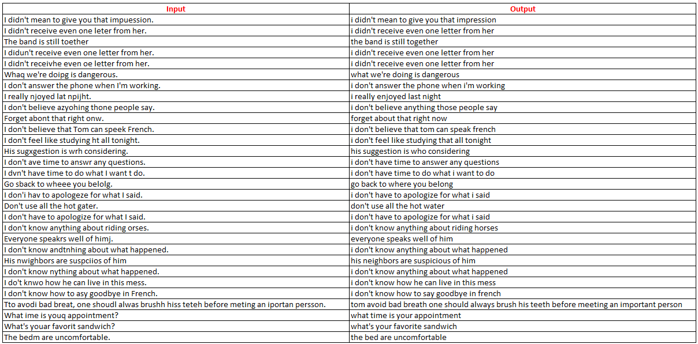

# Spelling Correction Transformer


## About The Project


### Introduction

My project is called **Spelling Correction**. This is a model which helps a person correct a sentence with spelling mistakes.

## Getting Started

To get started, you should have prior knowledge on **Python** and **Pytorch** at first. A few resources to get you started if this is your first Python or Tensorflow project:

- [Pytorch Tutorials](https://pytorch.org/tutorials/)
- [Python for Beginners](https://www.python.org/about/gettingstarted/)


## Installation and Run

1. Clone the repo

   ```sh
   git clone https://github.com/phkhanhtrinh23/spelling_correction_transformer.git
   ```
  
2. Use any code editor to open the folder **spelling_correction_transformer**.


## Outline

- Input: [`english.txt`](http://www.manythings.org/anki/) a English Dictionary.

- Output:`spelling_correction_transformer` is tis based on **Transformer Encoder-Decoder** model. It is fast in training and inference. The result is way better than my previous repo [`spelling_correction`](https://github.com/phkhanhtrinh23/spelling_correction)

## Results



## Contribution

Contributions are what make GitHub such an amazing place to be learn, inspire, and create. Any contributions you make are greatly appreciated.

1. Fork the project
2. Create your Contribute branch: `git checkout -b contribute/Contribute`
3. Commit your changes: `git commit -m 'add your messages'`
4. Push to the branch: `git push origin contribute/Contribute`
5. Open a pull request


## Contact

Email: phkhanhtrinh23@gmail.com

LinkedIn: https://www.linkedin.com/in/trinh-pham-3103081a0/

Project Link: https://github.com/phkhanhtrinh23/spelling_correction_transformer.git